<div align="center">

# 🌍 AI4Change — Problem Board

**This is where the world's problems come to get solved.**

Submit a problem your community faces. The community votes, discusses, and when enough people care — we build the solution. Open source. Together.

*Like Playing for Change, but for tech solutions.*


---

### 🗣️ [Submit a Problem →](../../issues/new?template=problem.yml)

### 💡 [Propose a Solution →](../../issues/new?template=solution-proposal.yml)

### 🙋 [Volunteer Your Skills →](../../issues/new?template=volunteer.yml)

### 📊 [Browse Trending Problems →](../../issues?q=is%3Aissue+is%3Aopen+sort%3Areactions-%2B1-desc)

### 💬 [Join the Discussion →](../../discussions)

---

</div>

## How It Works

The AI4Change flywheel — from problem to solution, powered by community:

```mermaid
graph LR
    A["🌱 Submit\nA problem is raised"] --> B["👍 Vote\nCommunity upvotes"]
    B --> C["💬 Discuss\nRefine & add context"]
    C --> D["📊 Rate\nScore impact & feasibility"]
    D --> E["✅ Commit\nTeam forms, work begins"]
    E --> F["🔨 Build\nOpen-source development"]
    F --> G["📦 Ship\nDeploy for the world"]
    G --> H["🔄 Learn\nFeedback improves everything"]
    H --> A

    style A fill:#4CAF50,color:#fff
    style B fill:#FF9800,color:#fff
    style C fill:#2196F3,color:#fff
    style D fill:#9C27B0,color:#fff
    style E fill:#F44336,color:#fff
    style F fill:#FF5722,color:#fff
    style G fill:#009688,color:#fff
    style H fill:#607D8B,color:#fff
```



1. **Submit** — Open an issue describing a real-world problem
2. **Vote** — 👍 react on problems you want solved
3. **Discuss** — Refine the problem, share local context, suggest approaches
4. **Rate** — Community scores problems on [impact, feasibility, data, and interest](docs/RATING.md)
5. **Propose** — Submit a [solution proposal](docs/SOLUTIONS.md) with technical approach
6. **Build** — When a problem reaches critical mass, we commit to solving it
7. **Ship** — Deploy it open source for everyone
8. **Learn** — Feedback from deployment feeds back into better solutions

## Seed Problems

These are the problems the community is currently exploring. Read them, vote on them, and add your voice.

| # | Problem | Category | Region | Difficulty | Status |
|---|---------|----------|--------|------------|--------|
| 001 | [Clean water monitoring for rural communities](seeds/001-water-quality-monitoring.md) | 💧 Water & Sanitation | Bangladesh | Intermediate | 🌱 Seed |
| 002 | [Crop disease detection for smallholder farmers](seeds/002-crop-disease-detection.md) | 🌾 Agriculture | East Africa | Intermediate | 🌱 Seed |
| 003 | [Medical supply chain tracking in disaster zones](seeds/003-medical-supply-chain-tracking.md) | 🚨 Disaster Response | Global | Advanced | 🌱 Seed |
| 004 | [Local language education content generation](seeds/004-local-language-education.md) | 🎓 Education | Global | Advanced | 🌱 Seed |
| 005 | [Community energy grid optimization](seeds/005-community-energy-grid.md) | ⚡ Energy | India | Intermediate | 🌱 Seed |
| 006 | [Disaster early warning for rural communities](seeds/006-disaster-early-warning.md) | 🚨 Disaster Response | Global | Advanced | 🌱 Seed |
| 007 | [AI accessibility tools for visually impaired](seeds/007-accessibility-visually-impaired.md) | 📱 Digital Inclusion | Global | Advanced | 🌱 Seed |
| 008 | [Deforestation monitoring via satellite imagery](seeds/008-deforestation-monitoring.md) | 🌍 Environment | Global | Intermediate | 🌱 Seed |
| 009 | [Mental health chatbot for underserved communities](seeds/009-mental-health-chatbot.md) | 🏥 Health | Global | Advanced | 🌱 Seed |
| 010 | [Food waste reduction in supply chains](seeds/010-food-waste-reduction.md) | 🌾 Agriculture | Global | Intermediate | 🌱 Seed |
| 011 | [Air quality monitoring and health alerts](seeds/011-air-quality-monitoring.md) | 🏥 Health & Environment | Global | Intermediate | 🌱 Seed |
| 012 | [Illegal fishing detection via vessel tracking](seeds/012-illegal-fishing-detection.md) | 🌍 Environment | Global | Intermediate | 🌱 Seed |
| 013 | [Refugee camp resource allocation optimizer](seeds/013-refugee-resource-allocation.md) | 🚨 Disaster Response | Global | Advanced | 🌱 Seed |
| 014 | [Endangered species identification from camera traps](seeds/014-endangered-species-identification.md) | 🌍 Environment | Global | Intermediate | 🌱 Seed |
| 015 | [Misinformation detection for local news](seeds/015-misinformation-detection.md) | 📱 Digital Inclusion | Global | Advanced | 🌱 Seed |

## Labels

| Label | Meaning |
|-------|---------|
| 🌱 `submitted` | New problem, awaiting community input |
| 🔥 `trending` | High community interest (5+ votes) |
| 💡 `solution-proposal` | A proposed solution to an existing problem |
| 🙋 `volunteer` | Someone offering their skills |
| ✅ `committed` | AI4Change has committed to building a solution |
| 🔨 `building` | Active development underway |
| 📦 `shipped` | Solution deployed and open source |

## Categories

Problems span every domain where AI can make a difference:

🌾 Agriculture & Food Security · 🎓 Education & Literacy · 🏥 Health & Medicine · 🌍 Environment & Climate · 🏗️ Infrastructure · 💧 Water & Sanitation · ⚡ Energy Access · 🚨 Disaster Response · 💰 Economic Development · 📱 Digital Inclusion

## Rules

- **One problem per issue** — keep it focused
- **Be specific** — "education is broken" is too vague; "rural schools in X can't access Y" is actionable
- **Include context** — who's affected, where, what's been tried
- **Be respectful** — these are real people with real challenges

## Automation & Bots

This repo uses GitHub Actions to keep the community running smoothly:

| Workflow | Trigger | What it does |
|----------|---------|-------------|
| [Auto-Label](/.github/workflows/auto-label.yml) | Issue opened/edited | Detects **categories** (agriculture, health, education, etc.), **regions** (africa, asia, latin-america, etc.), and **urgency** from issue content and applies labels automatically |
| [Trending Issues](/.github/workflows/trending.yml) | Weekly (Monday 9am UTC) + manual | Scores issues by reactions + comments. Adds 🔥 trending label above threshold, removes it if activity drops. Updates [trending.md](trending.md) |
| [AI Triage Bot](/.github/workflows/ai-triage.yml) | New issue (🌱 submitted) | Calls an AI model to summarize the problem, detect duplicates, identify needed skills, and assess actionability. Posts a triage comment |
| [Match Contributors](/.github/workflows/match-contributors.yml) | Issue labeled ✅ committed | Scans volunteer profiles and suggests contributor matches based on skill/keyword overlap with the problem |
| [Welcome](/.github/workflows/welcome.yml) | Issue opened | Welcomes first-time contributors with context-specific guidance |
| [Stale](/.github/workflows/stale.yml) | Weekly (Monday 6am UTC) | Marks inactive issues as stale after 90 days, closes after 30 more. Trending/committed/building issues are exempt |

### Setup Scripts

```bash
# Create all required labels with correct colors
./scripts/setup-labels.sh ai4change-org/problems

# Create the 5 seed issues from seeds/ directory
./scripts/seed-issues.sh ai4change-org/problems
```

### Required Secrets (for AI Triage Bot)

| Secret | Description |
|--------|-------------|
| `OPENAI_API_KEY` | OpenAI API key (default provider) |
| `ANTHROPIC_API_KEY` | Anthropic API key (alternative provider) |
| `AI_PROVIDER` | Set to `anthropic` to use Claude instead of GPT (optional, defaults to `openai`) |

Configure these in **Settings > Secrets and variables > Actions** in the repository.

## Get Involved

- 📖 [Contributing Guide](CONTRIBUTING.md) — everything you need to know
- 📊 [Problem Rating System](docs/RATING.md) — how problems get prioritized
- 💡 [Solutions Guide](docs/SOLUTIONS.md) — how to propose and build a solution
- 📜 [Code of Conduct](CODE_OF_CONDUCT.md) — how we treat each other
- 💬 [Discussions](../../discussions) — ideas, regional hubs, AI tools, mentorship
